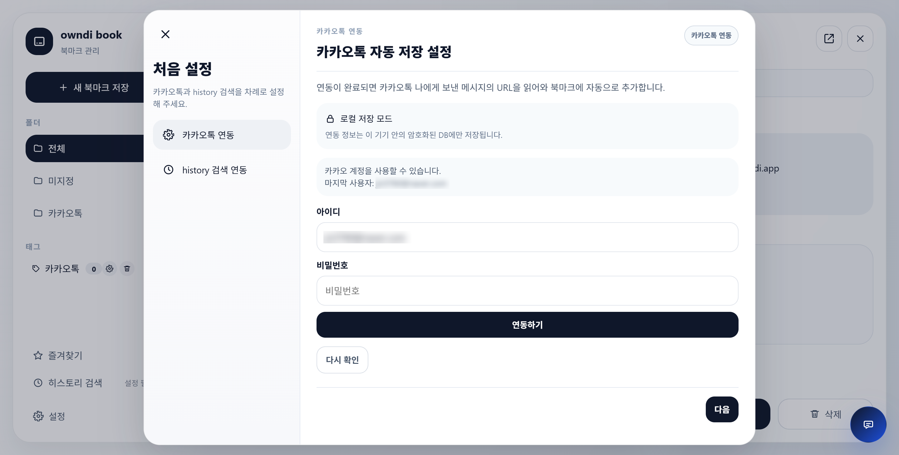
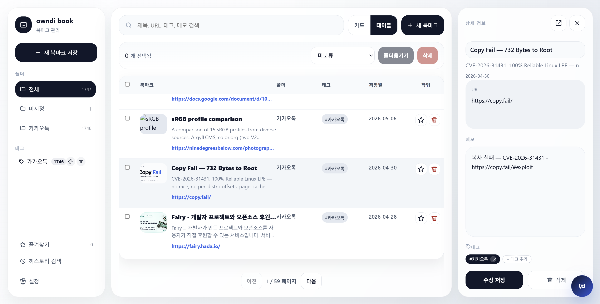
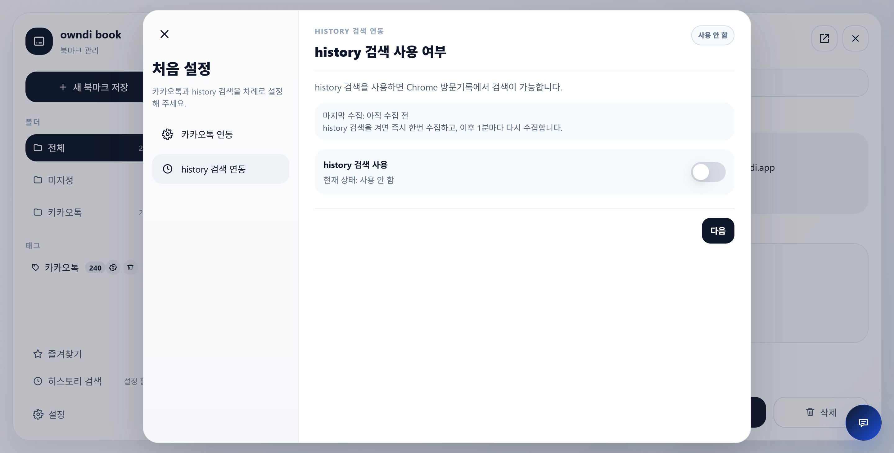

## 매번 카톡 나에게 보내기로 링크를 보내놓고 잊어버리시나요?

좋은 글을 발견했을 때, 나중에 읽고 싶은 자료를 봤을 때, 언젠가 다시 찾아봐야 할 페이지를 만났을 때.

우리는 자주 카카오톡을 엽니다.  
그리고 익숙하게 **나에게 보내기**로 링크를 보냅니다. (사실 제가 그래요 😅)

“나중에 봐야지.”  
“이건 저장해둬야지.”  
“언젠가 필요할 것 같아.”

하지만 조금만 시간이 지나도 다시 찾기가 어렵습니다..  
검색어가 기억나지 않으면 다시 찾기 어렵고,  
링크를 보냈다는 사실조차 잊어버릴 때도 많습니다.

그래서 만들었습니다.

**owndi book**은 카카오톡 나에게 보낸 링크를 자동으로 읽어와,  
내 북마크로 정리해주는 로컬 중심 북마크 앱입니다.

---

## 카톡에 보내면, 북마크가 됩니다

owndi book의 가장 중요한 기능은 단순합니다.

그저 카카오톡에서 나에게 링크를 보냅니다.  
그러면 owndi book이 그 URL을 읽어와 북마크에 자동으로 추가합니다.

별도의 확장 프로그램을 설치하지 않아도 됩니다.  
브라우저마다 저장 버튼을 찾을 필요도 없습니다.  
앱을 열고 직접 제목과 URL을 입력하지 않아도 됩니다.

평소 하던 방식 그대로,  
**카톡 나에게 보내기**만 하면 됩니다.

저장된 링크는 owndi book 안에서 제목, URL, 메모, 태그, 폴더 기준으로 다시 찾을 수 있습니다.

참고로 현재 Windows 에서만 가능하며, PC 에 PC 카톡이 설치되어 있고, 로그인 된 상태에서만 가능합니다.

연동하면 "나에게 보내기" 한 링크들이 추가되는것을 볼 수 있습니다.

---

## “나에게 보내기”는 편하지만, 정리는 어렵습니다

카카오톡 나에게 보내기는 많은 사람들이 이미 사용하는 임시 저장소입니다.

문제는 그 다음입니다.

링크, 메모, 이미지, 파일, 대화가 한곳에 섞입니다.  
나중에 다시 보려고 보낸 링크가 다른 메시지 사이로 밀려납니다.  
어떤 링크였는지 기억나지 않으면 검색도 어렵습니다.

owndi book은 이 흐름을 바꾸고 싶었습니다.

카톡은 그대로 사용하되,  
링크는 북마크 앱에서 정리되도록.

보내는 습관은 바꾸지 않고,  
찾는 경험만 더 좋아지도록.

---

## 내 기기 안에 저장되는 로컬 중심 북마크 & AI 검색

owndi book은 owndi의 방향처럼 **로컬 우선**을 기반으로 합니다.

카카오톡 연동 정보와 북마크 데이터는 기본적으로 사용자의 기기 안에 저장됩니다.

카카오톡 연동 정보가 저희 서버에 저장되지 않습니다.

PC 에 설치 된 카카오톡 앱에서 정보를 가져옵니다.

기술적으로는,
- 카카오톡 로그인은 로컬에서 카카오톡 서버와 직접 진행합니다. (처음 연동시 1회만 필요합니다.)  
- 로그인 과정에서 생성 된 access\_token, refresh\_token 등은 폐기됩니다. 다른 파라미터만 사용됩니다.  
- 해당 파라미터와 PC 데이터를 기반으로 DB 암호키 파생이 필요한데 이 부분은 부득이하게 owndi 서버에서 진행합니다. (1회)  
- 사용자 정보나 원본 값은 보내지 않고 연산에 필요한 일부 바이너리 데이터들만 주고받습니다.

또한 AI 검색을 기본으로 지원합니다.

[multilingual-e5-small-ko-v2](https://huggingface.co/dragonkue/multilingual-e5-small-ko-v2) 모델을 기반으로 북마크 정보를 임베딩하고,  
임베딩을 통한 의미 검색이 가능합니다.

이 또한 로컬에서 동작하며, 클라우드 AI 을 사용하지 않습니다.

(이를 위해 처음에 카톡 연동 시 많은 링크를 임베딩 하며 CPU 사용량이 잠시 올라갈 수 있습니다. 놀라지 마세요!)

---

## Chrome 방문기록에서도 찾을 수 있습니다

owndi book은 카카오톡 자동 저장뿐 아니라  
Chrome 방문기록 검색 연동도 제공합니다.

방문했던 페이지를 다시 찾고 싶은데 링크가 기억나지 않을 때,  
브라우저 기록을 뒤지는 대신 owndi book 안에서 검색할 수 있습니다.

북마크로 저장한 링크와 방문기록을 함께 활용하면,  
“분명히 봤는데 어디였지?”라는 순간을 줄일 수 있습니다.

사실 이 부분은 좀 더 개선이 필요한게,, 가능하면 내용으로 찾게 하고 싶은데 현재 URL, Title 만 지원합니다.

북마크처럼 opengrpah 을 모두 읽어서 저장할 수는 있겠으나 좀 비효율적인 측면이 있어서 고민 중입니다.

---

## 북마크를 다시 찾기 쉽게

owndi book에서는 저장된 링크를 폴더, 태그, 메모로 정리할 수 있습니다.

예를 들어 이런 식으로 사용할 수 있습니다.

-   카카오톡으로 받은 글은 자동으로 카카오톡 폴더에 저장
-   아직 분류하지 않은 링크는 미지정으로 관리
-   중요한 링크는 즐겨찾기에 추가
-   나중에 검색하기 쉽도록 메모와 태그 입력

많은 기능을 억지로 앞세우기보다,  
“저장한 링크를 다시 찾는다”는 기본 경험에 집중했습니다.

---

## 지금 시작해보세요

링크 저장은 이미 하고 계실지도 모릅니다.

다만 지금까지는 카카오톡 대화방 안에 흩어져 있었을 뿐입니다.

owndi book은 그 링크들을  
다시 찾을 수 있는 북마크로 바꿔줍니다.

카톡에 보내면, 북마크가 됩니다.

**owndi book**과 함께  
나에게 보낸 링크를 잊어버리지 않는 방식으로 저장해보세요.

---

## 설치하기

- VC 재배포 패키지가 없으시다면 먼저 https://aka.ms/vc14/vc_redist.x64.exe 을 설치해 주세요.
- 다운로드: [Release 로 이동하기](https://github.com/owndi-app/book-info/releases/tag/v0.0.1)

버그/이슈/질문은 [issues](https://github.com/owndi-app/book-info/issues) 을 이용해 주세요.

감사합니다 :)

<a href="https://fairy.hada.io/@owndi-book" target="_blank" rel="noreferrer noopener" style="padding: 7px 10px; border: 1px solid #ddd; border-radius: 4px; font-size: 0.92em; text-decoration: none;">
<svg class="topic-fairy-icon" width="24" height="24" viewBox="0 0 82 60" fill="none" aria-hidden="true" focusable="false">
<path d="M1.88404 0L1.31477 3.32055C-0.580255 14.3829 -0.442159 20.7011 1.82916 26.8612C5.46015 36.709 11.9068 44.2981 19.9687 48.2154C22.5389 49.4642 23.2747 49.6764 25.1969 49.7215C27.318 49.7713 27.4398 49.7338 27.5435 49.001C27.6853 47.9985 26.381 46.6378 22.3798 43.6152C13.3177 36.7695 8.96069 30.4735 6.63032 20.8557C6.20954 19.1191 6.09283 10.7352 6.46887 9.25581C6.56013 8.89637 6.64599 8.47867 6.6597 8.32787C6.69515 7.93944 12.6163 11.151 15.3443 13.0384C16.6023 13.9088 18.8996 15.7982 20.4499 17.2371C29.3058 25.4571 36.1187 37.6547 38.8677 50.2104C39.3267 52.3066 39.8624 54.7265 40.058 55.5885C40.2623 56.4891 40.5716 57.106 40.7855 57.0385C40.9902 56.9737 41.5752 55.1655 42.0849 53.0204C45.181 39.9896 49.3269 31.2431 56.5797 22.4423C61.6854 16.8093 66.736 12.0334 72.7925 9.30367C73.7033 8.89062 75.3966 7.90902 75.7263 7.76817C75.6858 8.69624 75.7883 11.5852 75.7902 14.4839C75.7939 19.2906 75.7183 19.9755 74.8469 22.9797C74.3257 24.7768 73.3476 27.354 72.6738 28.7069C70.1323 33.81 65.0702 39.5537 59.8358 43.2731C54.1731 47.2969 53.0091 48.5958 54.2509 49.5039C55.8096 50.6436 61.4353 49.0269 65.399 46.3007C67.7947 44.653 72.239 40.256 74.2477 37.5459C77.6845 32.9089 80.3843 26.8654 81.3751 21.5903C82.3368 14.2649 81.2269 7.49926 80.1491 0.430785C72.6813 2.27648 65.6417 6.22109 59.9724 10.7096C51.8908 17.1877 44.8303 27.622 41.6471 37.7923L41.1021 39.5352L40.3624 37.4655C35.6742 24.3511 27.6966 13.8298 17.1415 6.84023C14.2632 4.93423 9.1778 2.50765 5.18294 1.13408L1.88404 0ZM6.81031 41.8148C5.78241 41.8673 3.78643 43.2815 3.5606 44.1813C3.16514 45.7569 6.32314 50.598 9.89664 53.8947C12.4187 56.2214 15.975 58.2811 18.9387 59.1311C21.4735 59.8582 27.0061 59.9081 29.8831 59.23C33.5558 58.3644 34.2455 57.4332 32.6331 55.517C31.8245 54.5559 31.6769 54.5118 29.2839 54.5093C22.1571 54.5031 15.6867 51.2315 10.224 44.8725C8.80085 43.2157 7.3938 41.8845 7.00177 41.8238C6.94261 41.8151 6.87889 41.8109 6.81031 41.8148ZM74.6918 41.8888C74.669 41.8895 74.6463 41.8913 74.6235 41.8938C74.0758 41.9621 73.4992 42.6718 71.07 45.6202C70.1386 46.7507 68.5418 48.3411 67.521 49.1545C63.0676 52.7033 60.0195 53.8396 54.1073 54.1542C50.1262 54.3661 50.0529 54.3838 49.2889 55.3387C48.8622 55.872 48.5125 56.6998 48.5116 57.178C48.5103 57.8786 48.7806 58.1786 49.9028 58.7218C50.6688 59.0926 52.1024 59.539 53.0887 59.7142C58.8042 60.7294 65.372 59.002 70.4931 55.137C74.1765 52.3571 78.5911 46.1331 78.1438 44.3508C77.9111 43.4236 76.536 42.3054 75.2291 41.9805C75.0158 41.9274 74.8518 41.8838 74.6918 41.8888Z" fill="currentColor"></path>
</svg>
이 프로젝트가 마음에 드셨다면 Fairy <strong>@owndi-book</strong> 에서 응원해 주세요
<svg class="topic-fairy-newwin-icon" viewBox="0 0 24 24" fill="none" aria-hidden="true" focusable="false">
<path d="M14 5h5v5" stroke-width="2" stroke-linecap="round" stroke-linejoin="round"></path>
<path d="M13 11l6-6" stroke-width="2" stroke-linecap="round" stroke-linejoin="round"></path>
<path d="M19 14v4a2 2 0 0 1-2 2H6a2 2 0 0 1-2-2V7a2 2 0 0 1 2-2h4" stroke-width="2" stroke-linecap="round" stroke-linejoin="round"></path>
</svg>
</a>
